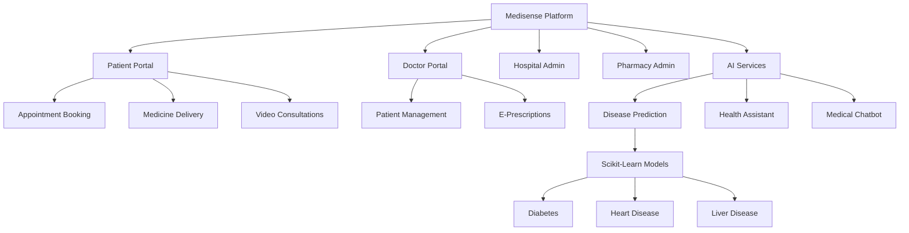
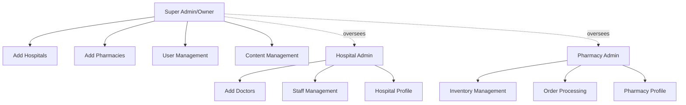

# MEDISENSE - AI-Powered Integrated Healthcare Platform 🏥💊🤖

## 🌟 Overview

Medisense is a comprehensive healthcare platform that connects patients, doctors, hospitals, and pharmacies in one integrated ecosystem. Our solution streamlines
healthcare delivery through digital appointment booking, e-prescriptions, medicine delivery, and AI-powered diagnostic assistance.

---

## 🌐 Live Demo

🔗 **[Try MEDISENSE NOW!](https://medisense-frontend.vercel.app/)**

---

## ✨ Key Features

### For Patients 👨‍👩‍👧‍👦

  - Doctor Appointments: Book in-person or virtual consultations
  
  - Medicine Delivery: Order prescriptions for home delivery
  
  - Video Consultations: Secure video calls with healthcare providers
  
  - Health Records: Digital storage of medical history
  
  - AI Symptom Checker: Preliminary health assessment
  
  - Pharmacy Finder: Locate nearby pharmacies with medicine stock

### For Doctors 👨‍⚕️

  - Appointment Management: View and schedule patient visits
  
  - E-Prescriptions: Send digital prescriptions to pharmacies
  
  - Patient Records: Access complete medical histories
  
  - Video Consultations: Conduct virtual appointments
  
  - Schedule Calendar: Manage availability and bookings

### For Hospitals 🏥

  - Staff Management: Add and manage doctors and staff
  
  - Resource Allocation: Manage rooms and equipment
  
  - Profile Management: Update hospital information
  
  - Achievement Tracking: Showcase hospital milestones
  
  - Analytics Dashboard: View operational metrics

### For Pharmacies 💊

  - Inventory Management: Track medicine stock levels
  
  - Order Processing: Manage and fulfill patient orders
  
  - Delivery Tracking: Monitor order fulfillment status
  
  - Prescription Verification: Validate e-prescriptions
  
  - Profile Management: Update pharmacy details

## AI Healthcare Assistant 🤖

  - Disease Prediction: Early detection of health conditions
  
  - Medical Chatbot: 24/7 health guidance
  
  - Symptom Analysis: Preliminary assessment tool
  
  - Health Recommendations: Personalized suggestions
  
  - Clinical Decision Support: Assistance for professionals

## KEY FEATURES VISUALS

## ⚙️ Technology Stack

  ### Frontend
  
   - React.js with Vite
    
   - Tailwind CSS
    
   - StoreContext for state management
    
   - WebRTC for video consultations
    
   - Responsive mobile-first design
    
  ### Backend
  
  - Node.js with Express.js
    
  - MongoDB with Mongoose
    
  - JWT Authentication
    
  - RESTful API architecture
    
  - Socket.io for real-time features
  
  ### AI/ML
  
   - Python with Scikit-Learn
    
   - Disease prediction models
    
   - Natural language processing
    
   - Medical data analysis

## 🚀 Getting Started

  Clone the repository:

    git clone https://github.com/yourusername/medisense.git
    
    cd medisense

  install backend dependencies:
  
    cd backend
    
    npm install   

  Configure environment variables:   

    cp .env.example .env
    # Update with your credentials

  Start backend server:  
  
    npm start

  Start patient portal:   

    cd ../frontend
    npm install
    npm start

## 🌐 API Endpoints

### 🔐 Authentication

    | Endpoint                    | Method | Description             | Authentication |
    | --------------------------- | ------ | ----------------------- | -------------- |
    | `/api/auth/register`        | POST   | Register new user       | None           |
    | `/api/auth/login`           | POST   | User login              | None           |
    | `/api/auth/logout`          | POST   | User logout             | JWT Required   |
    | `/api/auth/forgot-password` | POST   | Initiate password reset | None           |
    | `/api/auth/reset-password`  | POST   | Complete password reset | Token Required |

 ### 📅 Appointments

    | Endpoint                   | Method | Description               | Authentication |
    | -------------------------- | ------ | ------------------------- | -------------- |
    | `/api/appointments`        | POST   | Create new appointment    | JWT Required   |
    | `/api/appointments/user`   | GET    | Get user's appointments   | JWT Required   |
    | `/api/appointments/doctor` | GET    | Get doctor's appointments | Doctor JWT     |
    | `/api/appointments/:id`    | GET    | Get appointment details   | JWT Required   |
    | `/api/appointments/:id`    | PUT    | Update appointment status | Doctor JWT     |

 ### 💊 Medicine

    | Endpoint                 | Method | Description                | Authentication |
    | ------------------------ | ------ | -------------------------- | -------------- |
    | `/api/medicines`         | GET    | Search medicines           | Optional       |
    | `/api/medicines/order`   | POST   | Place medicine order       | JWT Required   |
    | `/api/orders/user`       | GET    | Get user's medicine orders | JWT Required   |
    | `/api/orders/pharmacy`   | GET    | Get pharmacy's orders      | Pharmacy JWT   |
    | `/api/orders/:id/status` | PUT    | Update order status        | Pharmacy JWT   |

 ### 🏥 Healthcare Providers

    | Endpoint              | Method | Description          | Authentication |
    | --------------------- | ------ | -------------------- | -------------- |
    | `/api/doctors`        | GET    | Search doctors       | Optional       |
    | `/api/doctors/:id`    | GET    | Get doctor details   | Optional       |
    | `/api/hospitals`      | GET    | Search hospitals     | Optional       |
    | `/api/hospitals/:id`  | GET    | Get hospital details | Optional       |
    | `/api/pharmacies`     | GET    | Search pharmacies    | Optional       |
    | `/api/pharmacies/:id` | GET    | Get pharmacy details | Optional       |

    
 ### 🤖 AI Services

    | Endpoint                  | Method | Description                          | Authentication |
    | ------------------------- | ------ | ------------------------------------ | -------------- |
    | `/api/ai/predict/disease` | POST   | AI disease prediction                | Optional       |
    | `/api/ai/chat`            | POST   | Interact with medical chatbot        | Optional       |
    | `/api/ai/symptom-check`   | POST   | Symptom analysis and recommendations | Optional       |

 ### 👤 User Management

    | Endpoint                     | Method | Description            | Authentication |
    | ---------------------------- | ------ | ---------------------- | -------------- |
    | `/api/users/profile`         | GET    | Get user profile       | JWT Required   |
    | `/api/users/profile`         | PUT    | Update user profile    | JWT Required   |
    | `/api/users/medical-history` | GET    | Get medical history    | JWT Required   |
    | `/api/users/medical-history` | POST   | Add to medical history | JWT Required   |

  

    
